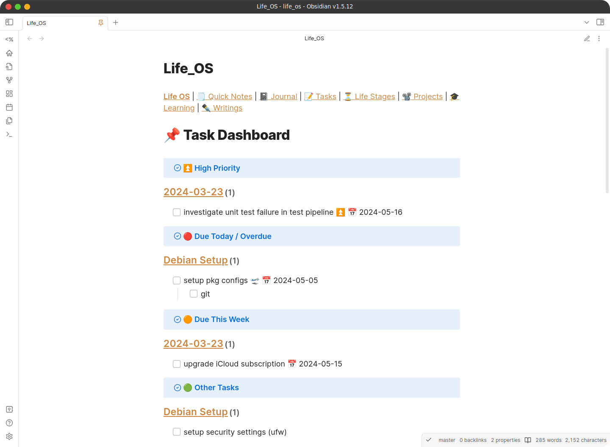
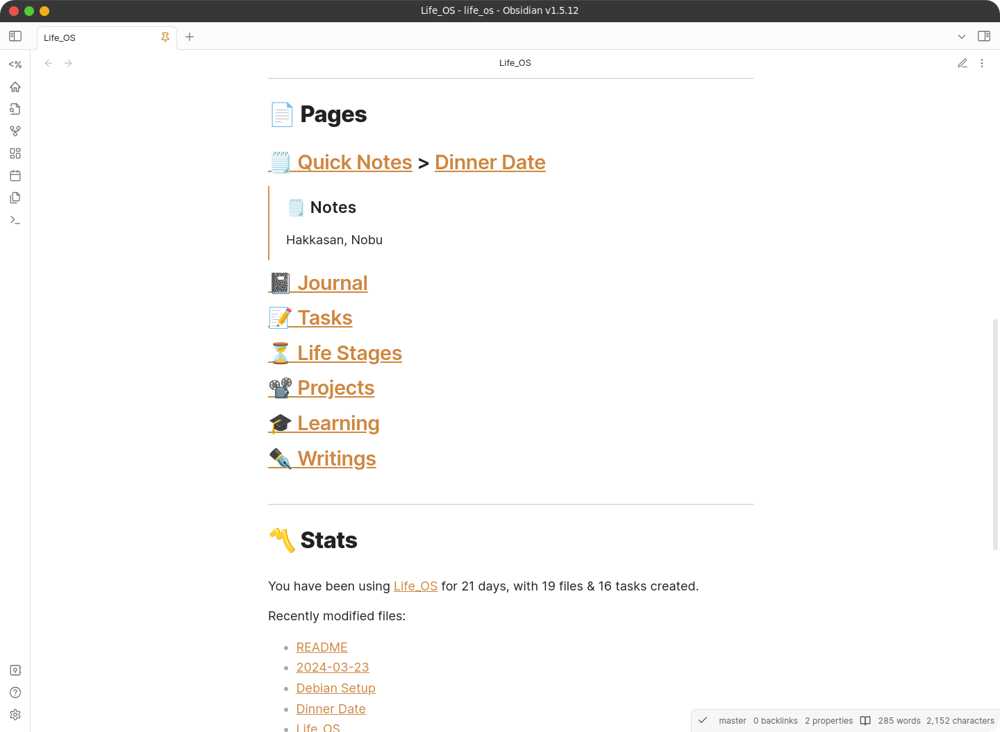
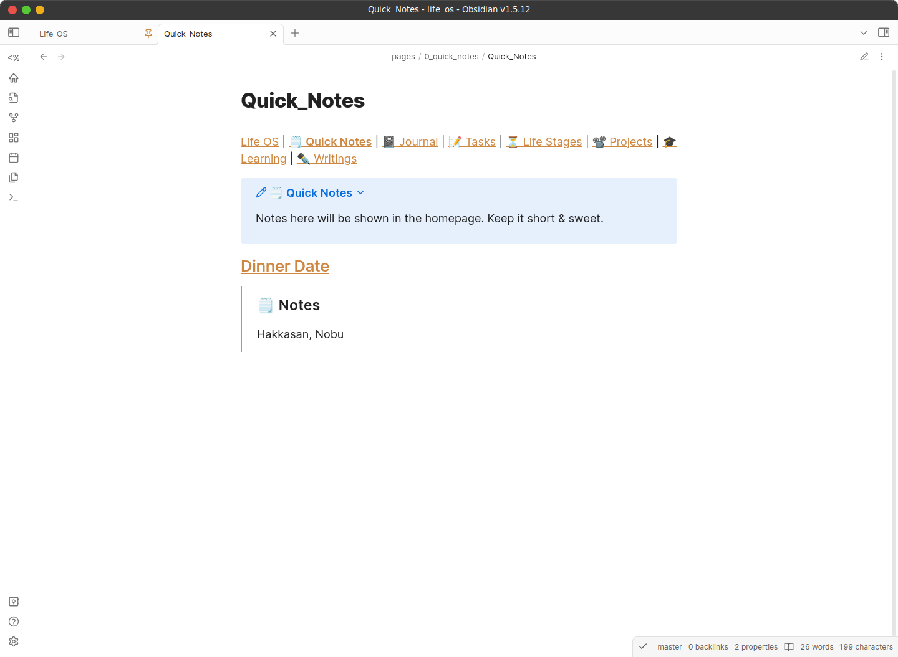
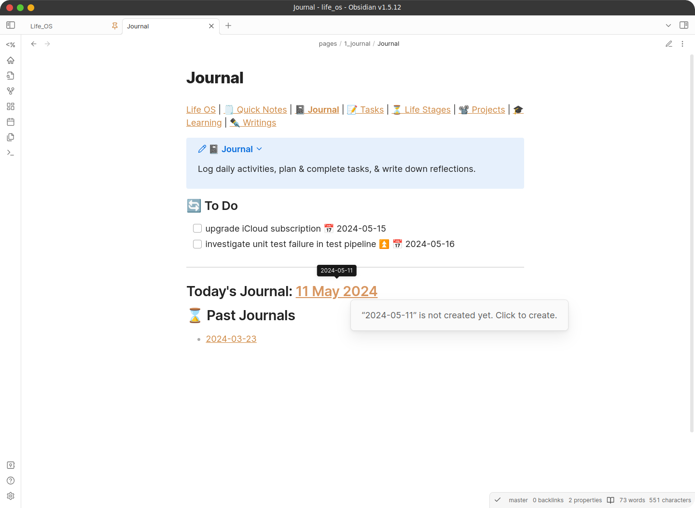
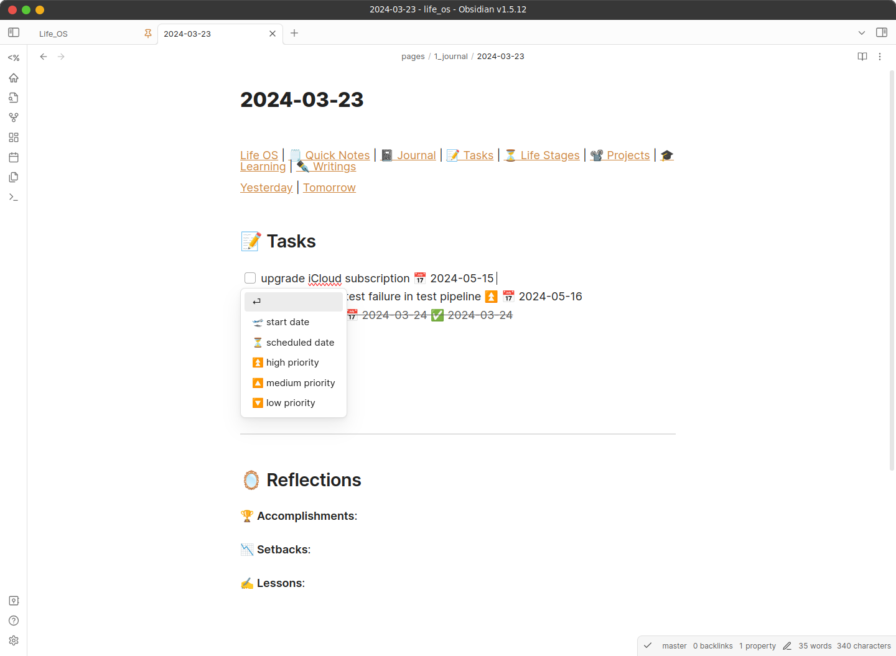
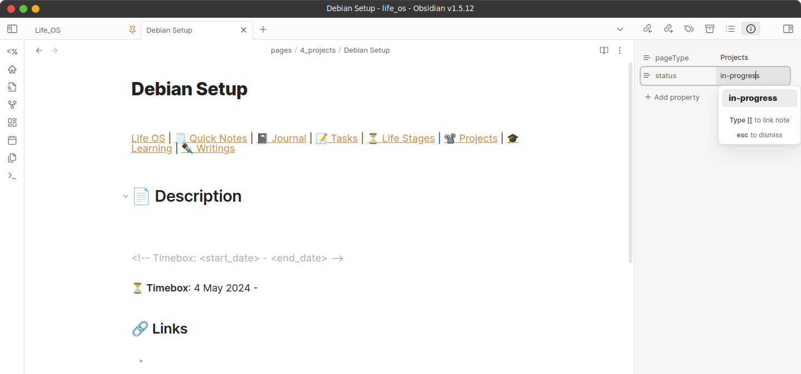
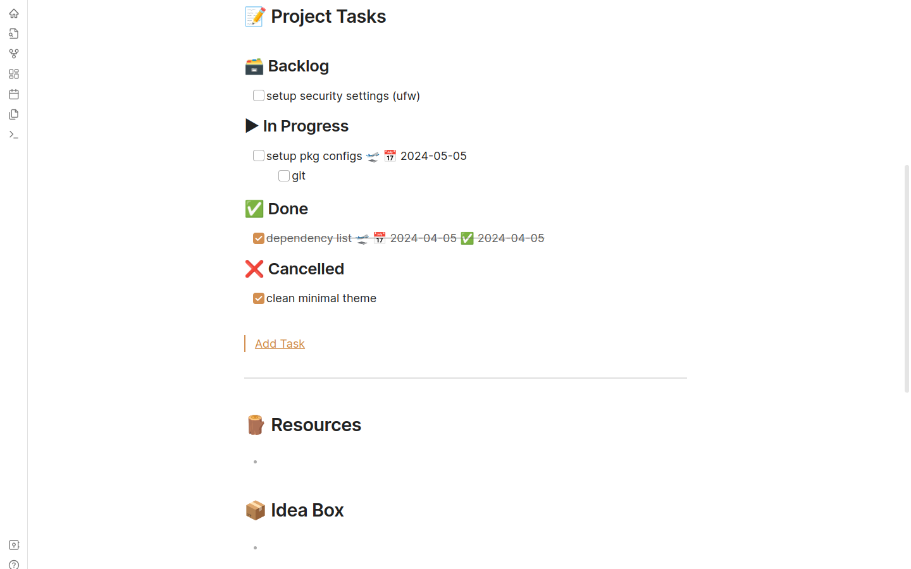
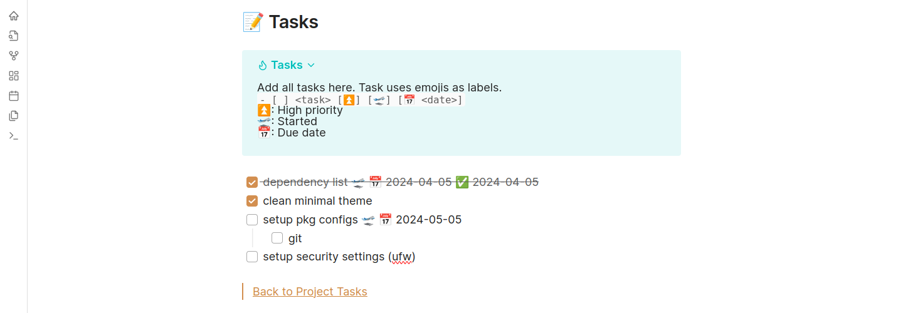
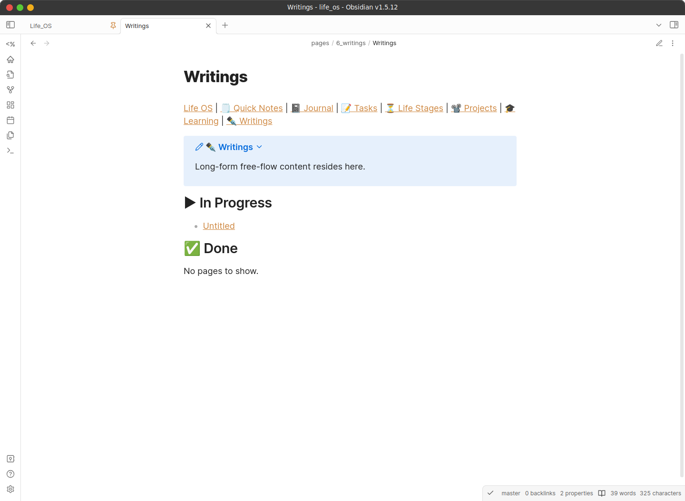
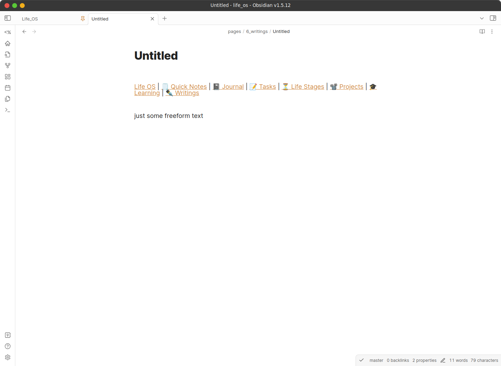

<div align="center">
   <!-- Logo -->
  <h1>Life OS</h1> <!-- Title -->
  <p>
    Life management system to organise & manage your life as an Obsidian vault.
  </p> <!-- Description -->
  <p>
    Built With: <a href="https://obsidian.md/">Obsidian</a> &bull; <a href="https://blacksmithgu.github.io/obsidian-dataview/">Dataview</a> &bull; <a href="https://github.com/saml-dev/obsidian-custom-js">CustomJS</a>
  </p> <!-- Built With -->
</div>

---

<details>
<summary>Table of Contents</summary>

- [About](#about)
- [Demo](#demo)
- [Getting Started](#getting-started)
  - [Prerequisites](#prerequisites)
  - [Installation](#installation)
- [Usage](#usage)
  - [Documentation](#documentation)
    - [Homepage](#homepage)
    - [Quick Notes](#quick-notes)
    - [Journal](#journal)
    - [Tasks / Life Stages / Projects / Learning](#tasks--life-stages--projects--learning)
    - [Writings](#writings)
  - [`life_os` script for Linux \& MacOS](#life_os-script-for-linux--macos)
  - [Online sync to GitHub via Obsidian Git](#online-sync-to-github-via-obsidian-git)
    - [Linux / macOS / Windows](#linux--macos--windows)
    - [Android / iOS](#android--ios)
    - [Pushing / Pulling (Syncing)](#pushing--pulling-syncing)
  - [Bugs](#bugs)
- [Roadmap](#roadmap)
- [License](#license)
- [Credits](#credits)
</details>

## About

Life OS is a note-taking, task-setting system that helps you to organise, track, & manage your life. Life OS dashboards provides a centralised way to view your progress across different areas of your life (daily activities, life stages (long-term plans), projects).

Created in Obsidian, packaged as a Obsidian vault template.

## Demo

All demo files are stored in `data/demo` folder. To interact with the demo vault, use the script `data/demo/demo.sh`.

```bash
./data/demo/demo.sh
```

By default, the script moves demo files into the appropriate folders.

Options:

- `-u`, `--uninstall`: Uninstall (moves demo files back to demo folder) 

## Getting Started

### Prerequisites

- [Obsidian](https://obsidian.md/)

### Installation

- Download [latest release](https://github.com/adoreblvnk/life_os/releases) / Clone repository (for latest updates).
- Obsidian > Open folder as vault > Trust author and enable plugins

## Usage

### Documentation

#### Homepage

**Task Dashboard**



The Task dashboard collates all uncompleted tasks in Life OS. Add tasks from any page.

**Pages & Stats**



Pages lists all dashboards in Life OS, which can also be accessed via the navbar. Quick Notes embeds the most recently modified note on the homepage as well.

Stats shows selected metadata from Dataview.

#### Quick Notes

**Quick Notes Dashboard**



Quick Notes dashboard lists all quick notes. All created notes show the embedded note & the page link. Generally, keep quick notes short as long note embeds will hinder accessibility & readability in the dashboard.

#### Journal

**Journal Dashboard**



The To Do section lists all uncompleted tasks sorted by recency.

To open Today's Journal, click "Today's Journal" on the Journal dashboard or "Daily notes: Open today's daily note" via Command palette. Past journals are stored from newest to oldest.

**Journal Page**



Each Journal page has an additional navbar link to yesterday & tomorrow. Next, daily tasks are stored here.

#### Tasks / Life Stages / Projects / Learning

**Projects Dashboard**


The To Do section lists all uncompleted tasks across all projects sorted by recency.

Next, projects are sorted according to their status. To modify a page status, edit the frontmatter yaml via "Properties view: Show file properties" via Command palette from the project page.

For Projects, a pseudo [Kanban Board](https://www.atlassian.com/agile/kanban/boards) style is adopted, hence pages have 4 statuses:

- Backlog: For projects not yet started
- In Progress: For projects started
- Done: For completed projects
- Cancelled: For projects formerly "In Progress" but ultimately did not complete

*NOTE: If you have come here from other page types, note that other page types may have **different** page statuses, hence this is a non-exhaustive list of page statuses, but the overall structure remains similar.*

**Project Page**







Within the Description section, note that the timebox starting date is automatically filled up.

The Project Tasks section is a mini dashboard of all project tasks. Add tasks via the "Add Task" navlink, where "Add Task" is located at the bottom of the page.

Task statuses, what they mean, & how to add them:

- Backlog: Normal task with text
- In Progress: Tasks with a start date symbol (🛫). It's not necessary to add a start date.
- Done: Tasks completed (Markdown `- [x]`)
- Cancelled: Tasks with hyphen symbol between task list square brackets (Markdown `- [-]`)

Adding emojis is easiest done with Tasks' [auto-suggest menu](https://publish.obsidian.md/tasks/Editing/Auto-Suggest) already included. Life OS only uses start date (🛫), high priority (⏫), & done (✅) (enabled by default when a task is completed).

*NOTE: Do **NOT** confuse task status with project status.*

#### Writings

**Writings Dashboard**



**Writings Page**



The Writings page is meant for long-form writings & highly unopinionated, hence only a navbar is included in the template.

### `life_os` script for Linux & MacOS

*NOTE: Currently in alpha stages. Run `life_os -h` for help.*

### Online sync to GitHub via [Obsidian Git](https://publish.obsidian.md/git-doc/Getting+Started#Start%20with%20existing%20remote%20repository)

Prior to this, users should've cloned / downloaded Life OS. Ensure that the `.git` folder exists.

1. [Create](https://docs.github.com/en/repositories/creating-and-managing-repositories/creating-a-new-repository#creating-a-new-repository-from-the-web-ui) your personal GitHub repository.

#### Linux / macOS / Windows

1. Follow the steps in Obsidian Git's [Authentication](https://publish.obsidian.md/git-doc/Authentication).
2. Link your GitHub repo via [changing the remote repository's URL](https://docs.github.com/en/get-started/getting-started-with-git/managing-remote-repositories#changing-a-remote-repositorys-url) or via Obsidian's Command palette *(see [Android / iOS](#android--ios))*.

*NOTE: For Linux installation via Flatpak, only SSH is supported. The other alternative is to authenticate with the PAT in the URL (eg. `https://<PAT>@github.com/adoreblvnk/life_os`), which is insecure.*

#### Android / iOS

1. Create a [Personal Access Token (PAT)](https://docs.github.com/en/authentication/keeping-your-account-and-data-secure/managing-your-personal-access-tokens#creating-a-fine-grained-personal-access-token) with minimal permissions of "Read access to metadata" & "Read and Write access to administration, code, commit statuses, and pull requests".
2. In Obsidian settings, go to Community Plugins > Git > Authentication/Commit Author.
3. Enter your username, PAT, author name, & author email.
   - *NOTE: Enter your author name & author email as per your GitHub username & email.*
   - *TIP: Use GitHub's [noreply](https://docs.github.com/en/account-and-profile/setting-up-and-managing-your-personal-account-on-github/managing-email-preferences/setting-your-commit-email-address#about-commit-email-addresses) email address for privacy.*
4. Open Obsidian's Command palette > Git: Edit remotes > origin. Enter the URL of the GitHub repo you created.

#### Pushing / Pulling (Syncing)

1. To push local changes to remote, use Obsidian's Command palette > Git: Push.
2. To pull new changes from remote, use Obsidian's Command palette > Git: Pull.
   - *NOTE: Changes are auto pulled by default when Obsidian launches.*

### Bugs

- Javascript not rendering occasionally.
  - ```
    TypeError: Cannot read properties of undefined (reading 'file')
    ```
  - Fix: Reload DataviewJS block / close & reopen page. This occurs when Dataview fails to execute a query in time. Not a byproduct of Life OS' code.

## Roadmap

- [ ] Clean up code in `CustomUtils`.
- [ ] Implement dashboard banners for aesthetics.
- [ ] Auto-update Life OS via script.
  - [ ] Fix merge strategies.

## License

This project is licensed under the terms of the MIT license.

## Credits

- [adore_blvnk](https://x.com/adore_blvnk)

## Acknowledgements  <!-- omit in toc -->

- [Obsidian Tasks](https://github.com/obsidian-tasks-group/obsidian-tasks)
- [Templater](https://github.com/SilentVoid13/Templater)
- [Homepage](https://github.com/mirnovov/obsidian-homepage)
- [Set View Mode per Note](https://github.com/AlexDavies8/obsidian-frontmatter-viewmode)
- [Emoji Toolbar](https://github.com/oliveryh/obsidian-emoji-toolbar)
- [Obsidian Git](https://github.com/denolehov/obsidian-git)
